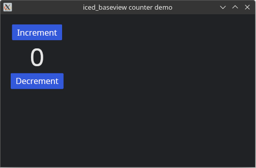

# iced_baseview

[](https://crates.io/crates/iced_baseview)
[](https://github.com/BillyDM/iced_baseview/blob/main/LICENSE)

A [`baseview`] backend for the [`Iced`] GUI library.

<div align="center">
    
</div>

## Simple Usage Example

```rust
use baseview::{Size, WindowOpenOptions, WindowScalePolicy};
use iced_baseview::*;

fn main() {
    let settings = Settings {
        window: WindowOpenOptions {
            title: String::from("iced_baseview slider"),
            size: Size::new(500.0, 300.0),
            scale: WindowScalePolicy::SystemScaleFactor,
        },
        flags: (),
    };

    IcedWindow::<MyProgram>::open_blocking(settings);
}

#[derive(Debug, Clone)]
pub enum Message {
    SliderChanged(u32),
}

struct MyProgram {
    slider_state: slider::State,
    slider_value: u32,
    slider_value_str: String,
}

impl Application for MyProgram {
    type Executor = executor::Default;
    type Message = Message;
    type Flags = ();

    fn new(_flags: ()) -> (Self, Command<Self::Message>) {
        (
            Self {
                slider_state: slider::State::new(),
                slider_value: 0,
                slider_value_str: String::from("0"),
            },
            Command::none(),
        )
    }

    fn update(&mut self, message: Self::Message) -> Command<Self::Message> {
        match message {
            Message::SliderChanged(value) => {
                self.slider_value = value;
                self.slider_value_str = format!("{}", value);
            }
        }

        Command::none()
    }

    fn view(&mut self) -> Element<'_, Self::Message> {
        let slider_widget = Slider::new(
            &mut self.slider_state,
            0..=1000,
            self.slider_value,
            Message::SliderChanged,
        );

        let content = Column::new()
            .width(Length::Fill)
            .align_items(Align::Center)
            .padding(20)
            .spacing(20)
            .push(Text::new("Slide me!"))
            .push(slider_widget)
            .push(Text::new(self.slider_value_str.as_str()));

        Container::new(content)
            .width(Length::Fill)
            .height(Length::Fill)
            .center_x()
            .center_y()
            .into()
    }
}
```

## VST / LV2 / AU Plugins

Examples of how to use this library for audio plugins can be found here:
* [`iced-baseplug-examples`]

[`Iced`]: https://github.com/hecrj/iced
[`baseview`]: https://github.com/RustAudio/baseview
[`iced-baseplug-examples`]: https://github.com/BillyDM/iced-baseplug-examples
